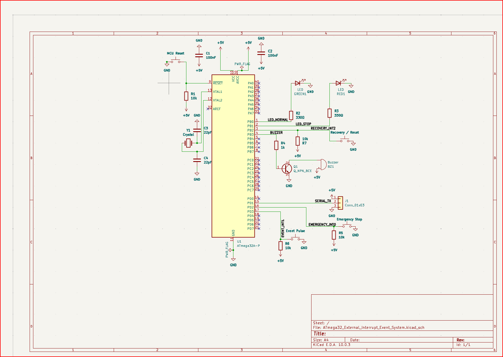
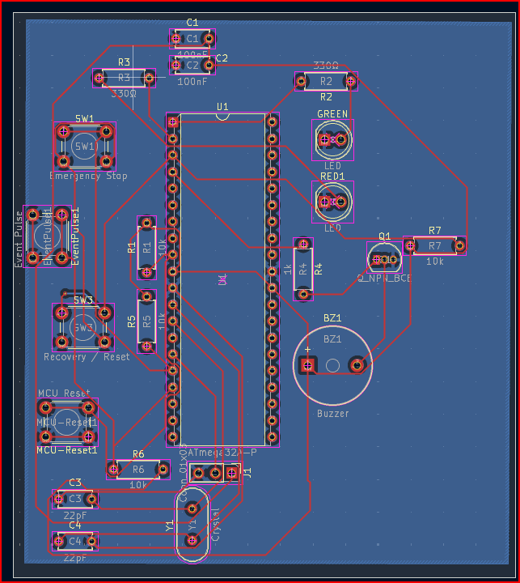
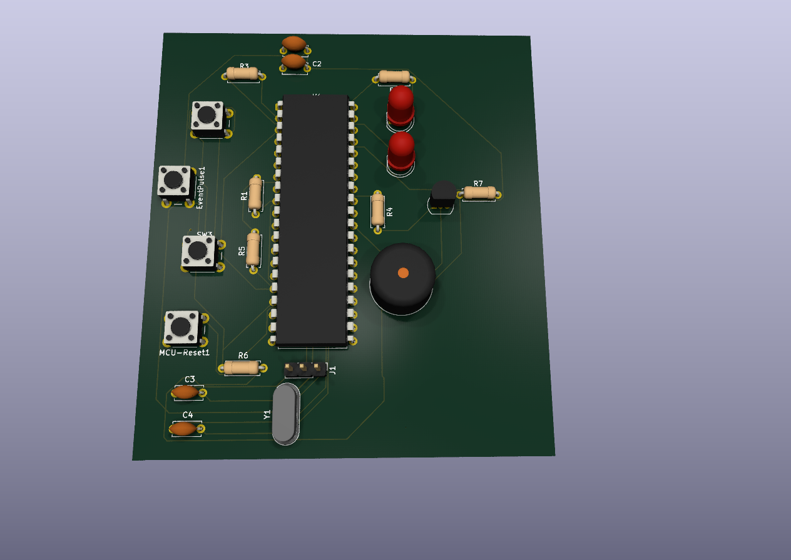

# ATmega32 External Interrupt Event Counter System

## CT 321 PBL 07 - External Interrupt-Based Emergency Stop and Event Counter System

This repository contains the completed ATmega32 external interrupt emergency stop and event counter system. The project demonstrates event-driven embedded-system control using INT0, INT1, and INT2. The design was verified using SimulIDE, KiCad, MPLAB for VS Code / AVR-GCC compatible firmware, Gerber export, and a recorded demonstration video.

---

## Final Submission Status

| Requirement | Evidence / Location | Status |
| --- | --- | --- |
| System block diagram | `documentation/block_diagram.png` | Complete |
| ATmega32 pin mapping table | `documentation/pin_mapping_table.md` | Complete |
| Firmware flowchart | `documentation/flowchart.png` | Complete |
| KiCad schematic | `kicad/schematic/kicad_schematic.png`, `.pdf`, and `kicad/ATmega32_External_Interrupt_Event_System.kicad_sch` | Complete |
| KiCad PCB layout | `kicad/pcb/kicad_pcb.png` and `kicad/ATmega32_External_Interrupt_Event_System.kicad_pcb` | Complete |
| KiCad PCB 3D view | `kicad/pcb/kicad_pcb_3D.png`, `kicad/pcb/kicad_pcb_3D_2.png` | Complete |
| DRC result | `kicad/pcb/drc_zero_errors.png` | Complete - 0 violations / 0 unconnected items |
| Gerber and drill files | `kicad/gerber/` | Complete |
| Firmware source code | `firmware/src/main.c` | Complete |
| Compiled HEX file | `firmware/hex/emergency_event_counter.hex` | Complete |
| SimulIDE circuit | `simulide/circuit/emergency_event_counter.sim1` | Complete |
| SimulIDE screenshots | `simulide/screenshots/` | Complete - 7 tests captured |
| Test results table | `documentation/test_results.md` | Complete |
| Demonstration video | `media/demo_video.mp4` | Complete |

---

## Circuit and PCB Images

### Schematic



### PCB Layout (2D)



### PCB 3D View




---

## System Behaviour

| Action | Expected Result |
| --- | --- |
| System powered ON | Green LED ON, red LED OFF, buzzer OFF, serial count = 0 |
| Event pulse on INT1 | Event count increases only in normal mode |
| Emergency stop on INT0 | Red LED and buzzer ON, green LED OFF, counting stops |
| Event during emergency | Count does not increase |
| Recovery on INT2 during emergency | System returns to normal mode and keeps the current count |
| Recovery/reset on INT2 during normal mode | Event count resets to zero |

---

## Important Simulation Settings

```text
MCU: ATmega32 / ATmega32A
Clock: 8 MHz
HEX file: firmware/hex/emergency_event_counter.hex
UART: 9600 baud, 8 data bits, 1 stop bit
Inputs: active LOW buttons with pull-ups
RESET: held HIGH during normal running
```

---

## Folder Structure

```text
ATmega32_External_Interrupt_Event_System/
├── README.md
├── firmware/
│   ├── src/main.c
│   ├── include/
│   └── hex/emergency_event_counter.hex
├── kicad/
│   ├── ATmega32_External_Interrupt_Event_System.kicad_pro
│   ├── ATmega32_External_Interrupt_Event_System.kicad_sch
│   ├── ATmega32_External_Interrupt_Event_System.kicad_pcb
│   ├── schematic/
│   ├── pcb/
│   └── gerber/
├── simulide/
│   ├── circuit/emergency_event_counter.sim1
│   └── screenshots/
├── documentation/
│   ├── block_diagram.png
│   ├── flowchart.png
│   ├── interrupt_configuration.md
│   ├── pin_mapping_table.md
│   └── test_results.md
└── media/
    ├── demo_video.mp4
    └── demonstration_video_link.txt
```

---

## Demonstration Summary

The final simulation and video demonstrate normal startup, single event counting, multiple event counting, emergency stop, lockout of event counting during emergency mode, recovery back to normal mode, and reset of the count in normal mode.
